# hse_hw3_chromhmm

## Информация о выполненной работе

**Выполнила:** Романова Анастасия, группа 2

[Ссылка на google colab](https://colab.research.google.com/drive/19kG6zqCzcrFhMscc0_WYtuTtMIq6gKMe?usp=sharing)

Клеточная линия | Гистоновая метка | Имя при обработке | Файл с гистоновой меткой  
--- | --- | --- | ---
A549 | H3K4me1  |  H3K04me1.bam  | wgEncodeBroadHistoneA549H3k04me1Dex100nmAlnRep1.bam
A549 | H3K4me2  |  H3K04me2.bam  | wgEncodeBroadHistoneA549H3k04me2Dex100nmAlnRep1.bam 
A549 | H3K4me3  |  H3K04me3.bam  | wgEncodeBroadHistoneA549H3k04me3Dex100nmAlnRep1.bam
A549 | H3K9ac   |  H3K09ac.bam   | wgEncodeBroadHistoneA549H3k09acEtoh02AlnRep1.bam
A549 | H3K9me3  |  H3K09me3.bam  | wgEncodeBroadHistoneA549H3k09me3Etoh02AlnRep1.bam
A549 | H3K27ac  |  H3K27ac.bam   | wgEncodeBroadHistoneA549H3k27acDex100nmAlnRep1.bam
A549 | H3K27me3 |  H3K27me3.bam  | wgEncodeBroadHistoneA549H3k27me3Dex100nmAlnRep1.bam
A549 | H3K36me3 |  H3K36me3.bam  | wgEncodeBroadHistoneA549H3k36me3Dex100nmAlnRep1.bam
A549 | H3K79me2 |  H3K79me2.bam  | wgEncodeBroadHistoneA549H3k79me2Dex100nmAlnRep1.bam 
A549 | H4K20me1 |  H4K20me1.bam  | wgEncodeBroadHistoneA549H4k20me1Etoh02AlnRep1.bam

Файл с контрольным экспериментом | Имя при обработке
--- | --- 
wgEncodeBroadHistoneA549ControlDex100nmAlnRep1.bam | Control.bam

## ChromHMM

RefSeqTSS | RefSeqTES | Emission | Overlap | Transition
--- | --- | --- | --- | ---
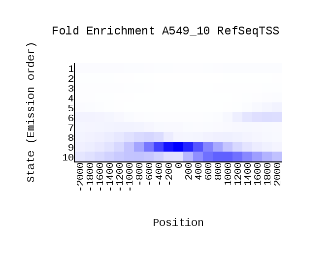 | 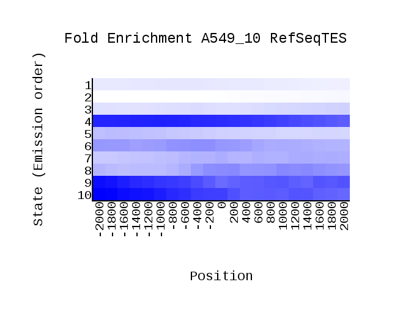 | 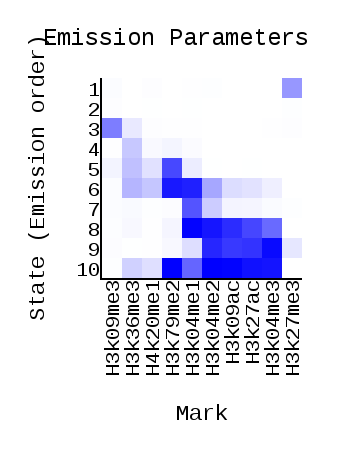 | 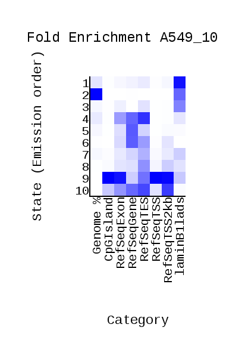 | 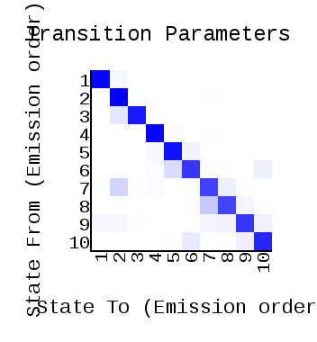

## Гистоновые модификации

Картинка | Выводы
--- | ---
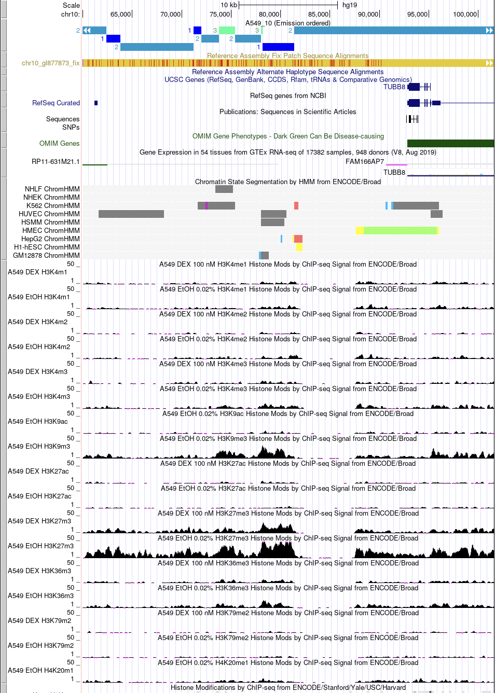 | **Cостояние 1** встречается среди 2 гистоновых модификаций: H3K27me3 и H3K9me3. Чаще всего находятся на ядерной ламине (попадает на участок репрессированного гетерохроматима) и не попадает на ген.
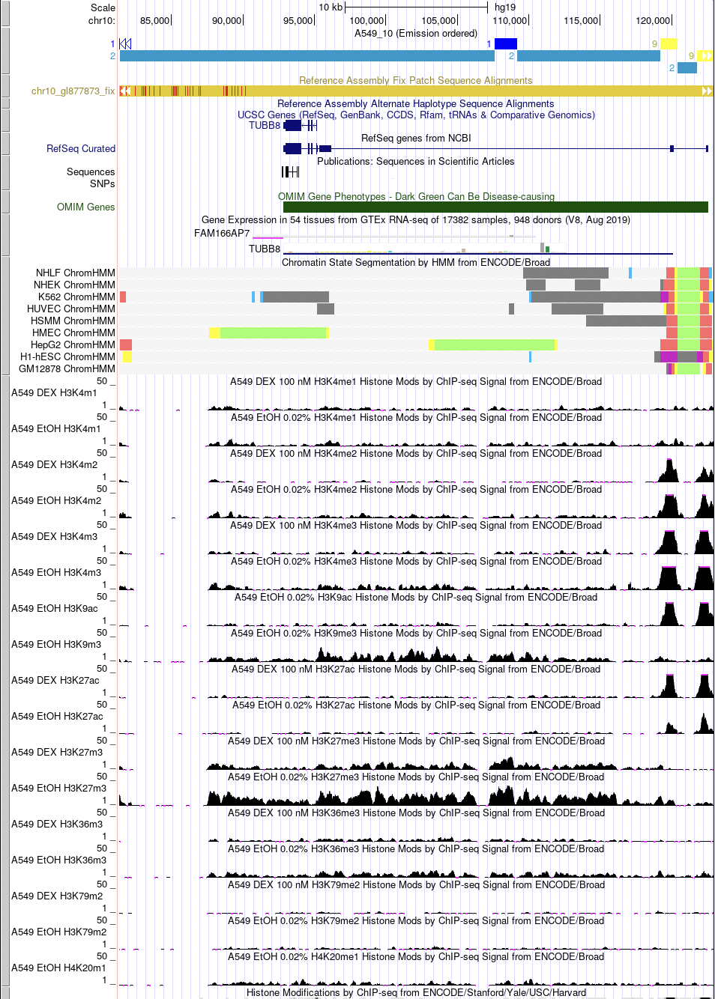 | **Cостояние 2** встречается среди 4 гистоновых модификаций: H3K20me1, H3K27me3, H3K4me1 и H3K9me3. Чаще всего находятся на ядерной ламине (попадает на участок репрессированного гетерохроматима) и не попадает на ген. 
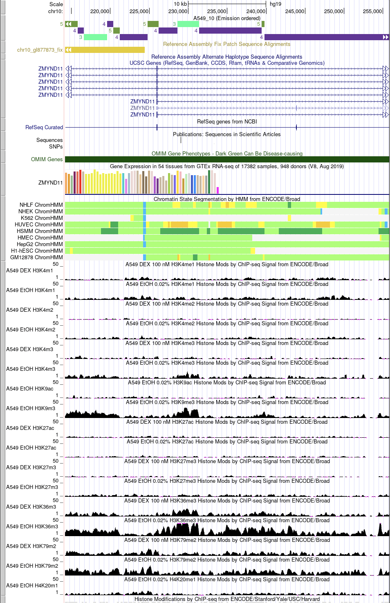 | **Cостояние 3** встречается среди 2 гистоновых модификаций: H3K36me3 и H3K9me3.  Чаще всего находятся на ядерной ламине (попадает на участок репрессированного гетерохроматима), реже на RefSeqTSS. Не попадает на ген или попадает на интрон. **Cостояние 4**  встречается среди 4 гистоновых модификаций: H3K36me3, H3K79me2, H3K9me3 и H4K20me1.  Чаще всего находятся на RefSeqTES, реже на RefSeqGene и RefSeqExon. Попадает на интроны или на экзоны.
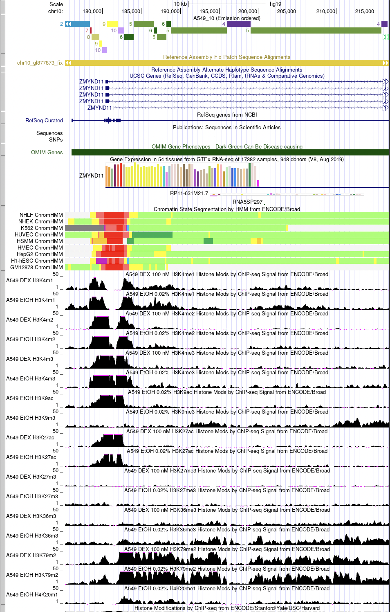 | **Cостояние 5** встречается среди 4 гистоновых модификаций: H3K4me1, H3K79me2, H4K20me1 и H3K36me3. Чаще всего находятся на RefSeqGene, реже на на RefSeqGene и RefSeqExon. Попадает на экзоны или интроны.
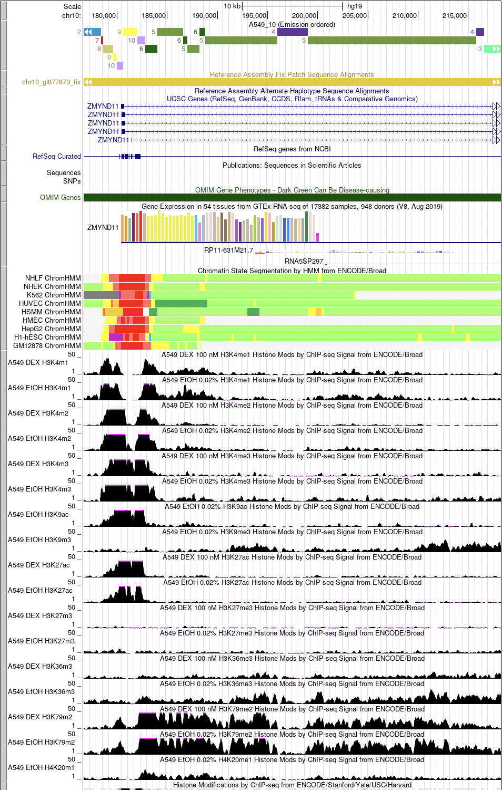 | **Cостояние 6** встречается среди 5 гистоновых модификаций: H3K4me1, H3K4me2, H3K4me3, H3K79me2 и H4K20me1. Чаще всего находятся на RefSeqTES, реже на на RefSeqGene и RefSeqExon. Попадает на интроны. **Cостояние 10** встречается среди 7 гистоновых модификаций: H3K27ac, H3K4me1, H3K4me2, H3K4me3, H3K9ac, H3K79me2 и H4K20me1. Чаще всего находятся на RefSeqTES и RefSeqTSS2Kb, реже на RefSeqExon и RefSeqGene. Не попадает на ген, попадает на интроны или экзоны.
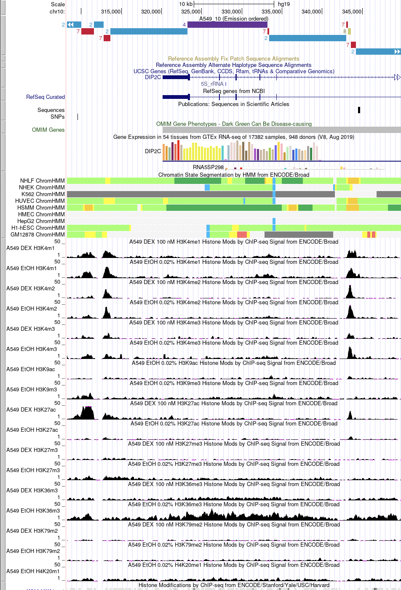 | **Cостояние 7** встречается среди 4 гистоновых модификаций: H3K27ac, H3K4me1, H3K4me2 и H3K9me3. Чаще всего находятся на RefSeqTES, реже на ядерной ламине (попадает на участок репрессированного гетерохроматима). Не попадает на ген и попадает на интроны.
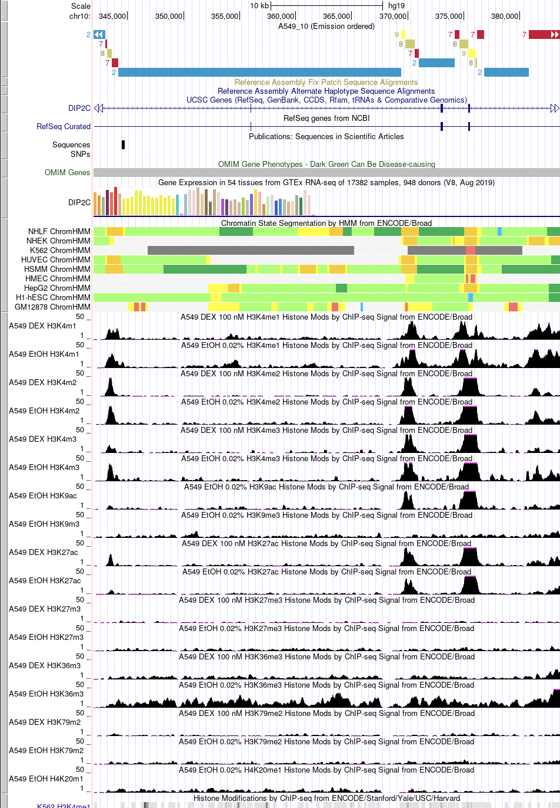 | **Cостояние 8** встречается среди 5 гистоновых модификаций: H3K27ac, H3K4me1, H3K4me2, H3K9ac и H3K9me3. Чаще всего находятся на RefSeqTES и RefSeqTSS2Kb, реже на ядерной ламине (попадает на участок репрессированного гетерохроматима), RefSeqGene и RefSeqExon. Попадает на интрон. **Cостояние 9** встречается среди 5 гистоновых модификаций: H3K27ac, H3K4me1, H3K4me2, H3K9ac и H3K9me3. Чаще всего находятся на CpGIslands, RefSeqTES, RefSeqExon, реже на RefSeqTSS2Kb и RefSeqTES. Не попадает на ген, попадает на интроны или экзоны.

**Cостояние 11-15** выражены неявно или их вовсе нет.

## Список запущенных команд

- Создаем и заполняем файл `cellmarkfiletable.txt`.
```
!touch cellmarkfiletable.txt

import os

control = 'Control.bam'

with open(f'cellmarkfiletable.txt', 'a') as cell_file:
  for file in os.listdir():
    if "Control" not in file and str(file).split('.')[-1] == 'bam':
      cell_file.write(f'A549\t{file[:-4]}\t{file}\t{control}\n')
```

- Конвертируем профили из ChIP-seq экспериментов в таблицу из 0 и 1
```
!java -mx5000M -jar /content/ChromHMM/ChromHMM.jar BinarizeBam -b 200  /content/ChromHMM/CHROMSIZES/hg19.txt /content/ cellmarkfiletable.txt   binarizedData
```

- Определяем 10 разных эпигенетических типов с наиболее выраженными наборами гистоновых меток и присваиваем каждому геномному интервалу определенный эпигенетический тип
```
!java -mx5000M -jar /content/ChromHMM/ChromHMM.jar LearnModel -b 200 /content/binarizedData/ /content/data 10 hg19
```

## Бонусная часть

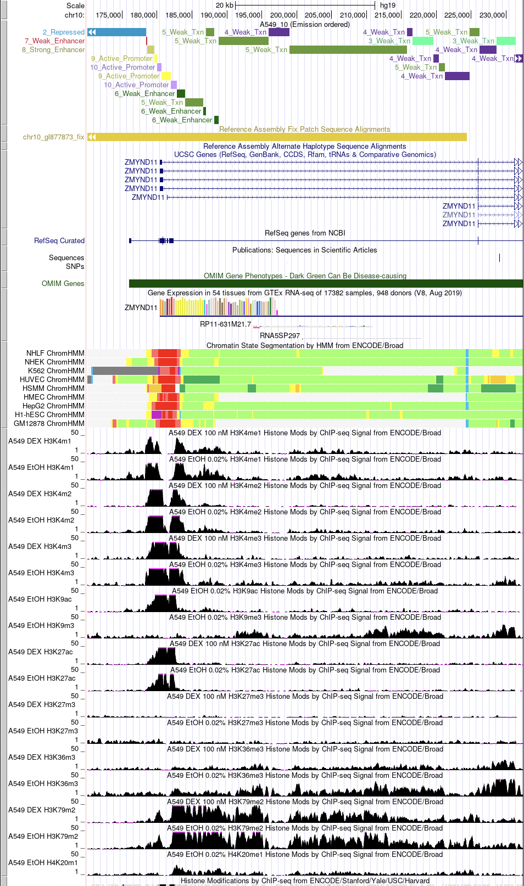
